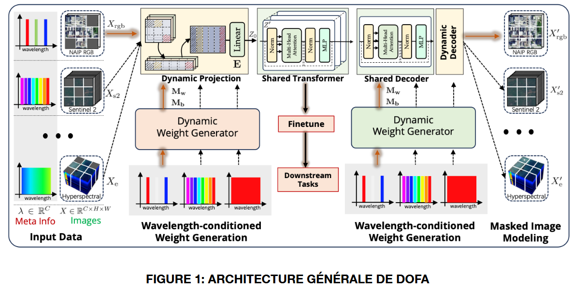

# TER 6: AISSAOUI Amine, ALLAIN Yanis

# Contexte de l’étude
Les modèles de fondation permettent l’apprentissage de représentations de données
adaptables à un grand nombre de tâches. Cet apprentissage est généralement réalisé sur
un grand nombre de données, souvent de manière auto-supervisée. Quelques exemples
de modèles de fondation bien connus sont les GPT, BERT ou DALL-E.
En télédétection, le développement de modèles de fondation est relativement récent. L’un
de ces premiers modèles est SatlasPretrain, présenté fin 2023. Dans ce travail, les
auteurs travaillent sur deux type d’imageries (optique très haute-résolution, et multi-
spectrale) pour entraîner un modèle pouvant être testé sur un ensemble de tâches. Le
problème de ce type de modèle est qu’il ne peut pas généraliser à des modalités non
vues lors de l’entrainement. Afin de résoudre ce problème Xiong et. al. ont proposé DOFA
afin d’adapter les poids aux caractéristiques d’un capteur particulier.

# Travail à réaliser
Les étudiants devront suivre les étapes suivantes:
- Se familiariser avec le modèle et son utilisation
- Reproduire les résultats obtenus par les auteurs sur un jeu de donnée 
- Essayer d’adapter le réseau à une nouvelle tâche: la détection d’objet

